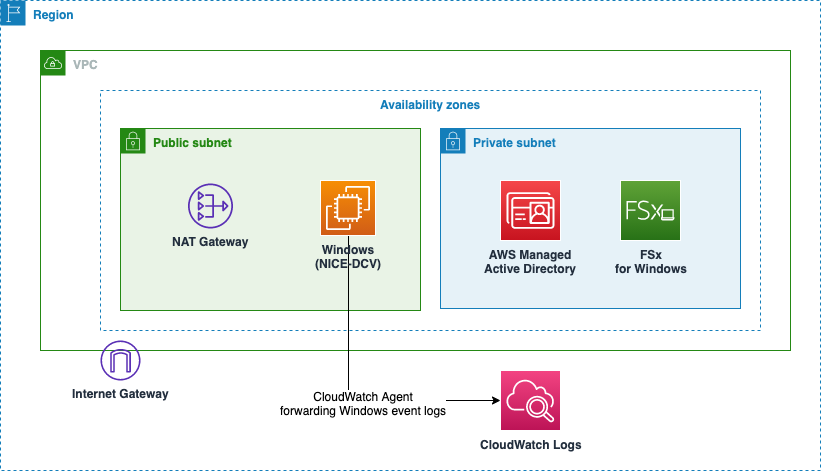

# NICE DCV server with Amazon FSx for Windows - Terraform sample
This sample shows you how to provision a [NICE DCV](https://aws.amazon.com/hpc/dcv/) Windows server with [Amazon FSx for Windows](https://aws.amazon.com/fsx/windows/) using Terraform.

It also includes [AWS Managed Active Directory](https://docs.aws.amazon.com/directoryservice/latest/admin-guide/directory_microsoft_ad.html) for authentication and CloudWatch Agent for recording Windows event log to [Amazon CloudWatch Logs](https://docs.aws.amazon.com/AmazonCloudWatch/latest/logs/WhatIsCloudWatchLogs.html).



## Deploy
Before deployment, you must install the following prerequisites on your environment:

* [Terraform CLI](https://www.terraform.io/downloads.html)
* [AWS CLI](https://aws.amazon.com/cli/)

You can modify the configuration of this sample (VPC CIDR, FSx storage capacity, Active Directory admin password, and more) by [`variables.tf`](variables.tf).
It's recommended to change at least `allowed_cidr` and `admin_password` variables for security.

After checking the configuration, you can deploy this sample by the following commands:

```sh
terraform init
terraform apply -auto-approve
```

The initial deployment takes approximately 40 minutes to complete.

You can proceed to validation step now.

## Validate
To validate if this sample is deployed correctly and see how it works, you can follow the steps below.

### 1. Install NICE DCV client
You must install NICE DCV client in your computer to access NICE DCV server. Download a client installer for your environment from the link below.

[NICE DCV Download](https://www.nice-dcv.com/)

### 2. Check the public IP address of NICE DCV server EC2 instance
Open [Amazon EC2 Management Console](https://console.aws.amazon.com/ec2/v2/home), and check the public IP address of your NICE DCV server instance.

You can also check the instance's public IP address by the following command:

```sh
terraform output instance_ips
```

You will need this address when you connect to the instance using NICE DCV client.

### 3. Connect to the EC2 instance via NICE DCV protocol
Now, you can connect to the Windows instance using the IP address and NICE DCV client.
Please refer to [Connecting to a NICE DCV Session](https://docs.aws.amazon.com/dcv/latest/userguide/using-connecting.html) for detailed instructions.

Username will be `[The domain name of your active directory]\admin`, and password is the one you specified in `admin_password` of  [`variables.tf`](variables.tf) .
For example, if your domain is `corp.example.com`, your username will be `corp\admin`.

When successsfully signing in to the server, you will see a Windows desktop screen.

### 4. Change Windows settings (optional)
Please customize Windows settings as needed.

* Automatically mounts FSx drive when you sign in
    1. Install `Group Policy Management` tools from `Server Manager`
        * You can refer to this document: [Installing the Active Directory administration tools](https://docs.aws.amazon.com/directoryservice/latest/admin-guide/ms_ad_install_ad_tools.html) 
    2. Set group policy to mount FSx drive when you sign in: [How To Map Network Drives With Group Policy](https://activedirectorypro.com/map-network-drives-with-group-policy/)
        * You need this operation only once for an Active Directory
        * Drive URL (`Location`) will be `\\[FSx DNS name]\share`
            * You can check FSx DNS name by running the following command: `terraform output fsx_dns_name`
    * You can also mount FSx drive manually instead: [Step 2: Map your file share to an EC2 instance running Windows Server](https://docs.aws.amazon.com/fsx/latest/WindowsGuide/getting-started-step2.html)
* Allow file downloads using Internet Explorer
    * To download and install other Web browsers, follow the document: [How do I configure an EC2 Windows instance to allow file downloads using Internet Explorer?](https://aws.amazon.com/premiumsupport/knowledge-center/ec2-windows-file-download-ie/)

### Check Windows event logs in CloudWatch Logs
This sample sends several Windows event logs to CloudWatch Logs by installing and configuring CloudWatch Agent when the instance is initialized.

With CloudWatch Logs, you can record, monitor, or notify those events for example when a user signed in.
To see the actual log records, open [Log Groups in CloudWatch Logs Management Console](https://console.aws.amazon.com/cloudwatch/home#logsV2:log-groups) and check log groups named `ec2-windows-security` and `ec2-windows-system`.
The records for each instance are in their own Log streams.

We configure CloudWatch Agent by the file [`modules/windows/cloudwatch_agent_config.json`](modules/windows/cloudwatch_agent_config.json).
If you want to customize log outputs, please refer to the document [Manually create or edit the CloudWatch agent configuration file](https://docs.aws.amazon.com/AmazonCloudWatch/latest/monitoring/CloudWatch-Agent-Configuration-File-Details.html).

## Clean up
To avoid incurring future charges, clean up the resources you created.

You can remove all the AWS resources by the following command:

```sh
terraform destroy -auto-approve
```

## Security

See [CONTRIBUTING](CONTRIBUTING.md#security-issue-notifications) for more information.

## License

This library is licensed under the MIT-0 License. See the LICENSE file.
